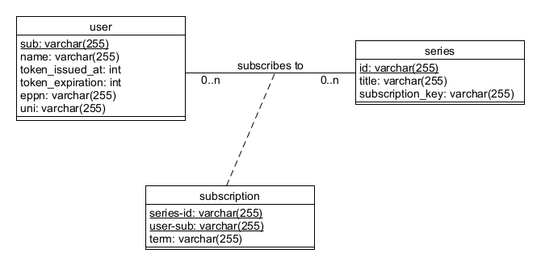

# Datenbank
Zum Betrieb des Backends ist ein relationales Datenbanksystem notwendig, in dem die nötigen Daten zum Operieren gespeichert werden können. Daher ist es nötig, dass Zugriff auf eine MySQL-Datenbank besteht.

## Konfiguration
Die Login-Daten für die Datenbankverbindung müssen in der Konfigurationsdatei (`.login.yaml`) angegeben werden. Nähere Informationen können in der [Setup-Dokumentation](setup.md#datenbank) gefunden werden.  
**Wichtig:** Es wird empfohlen die MySQL-Variablen `wait_timeout` und `interactive_timeout` zu erhöhen, damit eine Dysfunktion des Backends wegen abgebrochener Verbindung ausgeschlossen werden kann.

## Aufsetzen
Zur Inbetriebnahme ist nach der richtigen Konfiguration der Login-Daten und der richtigen Rechte Zuteilung Nichts weiter zutun. Alle Tabellen werden automatisch erstellt.

## Daten
Im Folgenden ist erläutert, welche Daten gespeichert werden. Es handelt sich hauptsächlich um Daten zur Ermöglichung des Abonnieren-Features.  

*Modell der Datenbanktabellen als UML-Klassendiagramm (Primary Keys sind unterstrichen)*

  
Zum Einen werden eindeutige Nutzerdaten gespeichert, die es ermöglichen die User beim Login zu identifizieren und einer Universität zuzuordnen. Diese Zuordnung ist technisch notwendig um jedem Studierenden den Zugriff auf die Kurse und Videos seiner Universität zu ermöglichen. Des Weiteren werden einige technische Daten zum Login-Token gespeichert, genaueres dazu kann [hier](login.md) gefunden werden.  

Außerdem werden die vorhandenen Serien gespeichert, was erleichtert den Zugriff auf verfügbare Serien erleichtert und das Verwenden von einem Passwort/Einschreibeschlüssel zum exklusiven Zugang zu Kursvideos ermöglicht.

Die Tabelle Subscription (engl. für "Abonnement") speichert die Relation zwischen Nutzern und den Serien und gibt an, welcher Studierende, welchen Kurs gespeichert hat. Diese Abonnements werden noch in Semester gegliedert, um dem User im Frontend eine einfache Ansicht ermöglichen zu können.