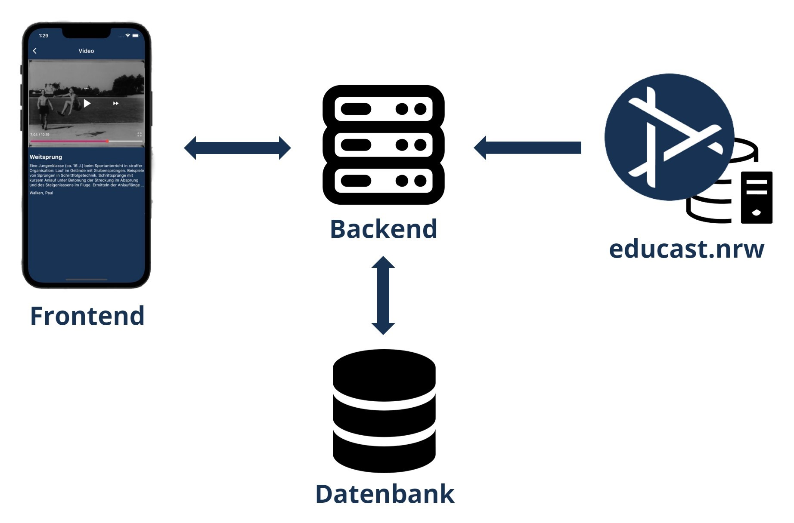

# Entwurf

In diesen Abschnitt sind die getroffenen Entwurfsentscheidungen und die Strukturen beschrieben, mit denen die Anforderungen an die App umgesetzt sind.

## Entwurfsentscheidungen

### Frontend

Nutzung des Flutter-Frameworks! Warum? Vorteile, Nachteile, usw.
Das schreibt Tom, oder?

### Backend
Die Aufgabe des Backends ist das Bereitstellen von Daten, die im Frontend gebraucht werden. Hierbei geht es um die Abfrage von verfügbaren Serien, Videos, Metadaten sowie das Verwalten von Abonnements.  

Um diese Aufgabe vollumfänglich zu erfüllen ist das Entwickeln einer REST-API nötig, mit der das Frontend Daten mittels HTTP-Requests anfordern kann. Für die Entwicklung unserer REST-API haben wir ein Python-Programm mit dem Webframework [Flask](https://flask.palletsprojects.com/en/2.2.x/) entwickelt.

Mit einem knappen zeitlichen Rahmen und einem kleinen Team, war bei der Auswahl, der für das Backend verwendeten Programmiersprache, vor Allem wichtig, dass wir schnell eine funktionierende Anwendung entwickeln können. Da wir zum Teil schon erfahren in der Verwendung von Python waren und die Sprache außerdem eine im Vergleich sehr leicht zu erlernende Programmiersprache ist, war sie die beste Wahl für uns.

Auch bei der Wahl des Webframeworks legten wir dieses Maß an und entschieden uns für Flask. Flask ist ein light-weight Framework, der relativ minimal ist, sodass schon mit wenig Code ein funktionierender Webserver erstellt werden kann.

## Struktur

Das Backend stellt die Daten für das Frontend bereit. App spezifische Daten, wie z.B. die abonnierten Vorlesungen der Studierenden sind in der [Datenbank](database.md) von dem Backend gespeichert. Diese werden vom Backend aufbereitet und über die [REST-API Endpunkte](https://app.swaggerhub.com/apis-docs/Bennit/EducastNRWApp/0.1#/) bereitgestellt.

Die Vorlesungsvideos und die zugehörigen Metadaten hat jede Hochschule auf ihrer educast-Instanz gespeichert. Jede Hochschule, die den educast-Dienst nutzt und folglich so eine Instanz betreibt, kann die App somit nutzen. Das Backend der App benötigt dann die Berechtigung um API-Anfragen an den educast-Server senden zu können. Diese Informationen werden dann vom Backend für die App spezifisch aufbereitet und mittels der [API-Endpunkte](https://app.swaggerhub.com/apis-docs/Bennit/EducastNRWApp/0.1#/) des Backends für das Frontend bereitgestellt. In der folgenden Grafik ist diese Struktur Veranschaulicht.

*Serverstruktur*

### API
Die API-Endpunkte des Backends sind [hier](https://app.swaggerhub.com/apis-docs/Bennit/EducastNRWApp/0.1#/) als Swagger Dokumentation zu finden. Es können auch Testanfragen mit dem Testuser und [Stable Opencast](https://stable.opencast.org) als Datenquelle, gesendet werden.

### Login
Der Login der Studierenden in die App ist mittels "OpenID Connect" (OIDC) über DFN-AAI umgesetzt. Dieser Prozess wird genauer auf der [Login Seite](login.md) beschrieben.