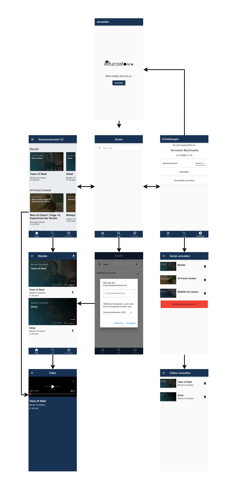

# Entwurf

In diesen Abschnitt sind die getroffenen Entwurfsentscheidungen und die Strukturen beschrieben, mit denen die Anforderungen umgesetzt sind.

## Entwurfsentscheidungen

### Frontend

Nutzung des Flutter-Frameworks! Warum? Vorteile, Nachteile, usw

### Backend
Die Aufgabe des Backends ist das Bereitstellen von Daten, die im Frontend gebraucht werden. Hierbei geht es um die Abfrage von verfügbaren Serien, Videos, Metadaten sowie das Verwalten von Abonnements.  

Um diese Aufgabe vollumfänglich zu erfüllen ist das Entwickeln einer REST-API nötig, mit der das Frontend Daten mittels HTTP-Requests anfordern kann. Für die Entwicklung unserer REST-API haben wir ein Python-Programm mit dem Webframework [Flask](https://flask.palletsprojects.com/en/2.2.x/) entwickelt.

Mit einem knappen zeitlichen Rahmen und einem kleinen Team, war bei der Auswahl, der für das Backend verwendeten Programmiersprache, vor Allem wichtig, dass wir schnell eine funktionierende Anwendung entwickeln können. Da wir zum Teil schon erfahren in der Verwendung von Python waren und die Sprache außerdem eine im Vergleich sehr leicht zu erlernende Programmiersprache ist, war sie die beste Wahl für uns.

Auch bei der Wahl des Webframeworks legten wir dieses Maß an und entschieden uns für Flask. Flask ist ein light-weight Framework, der relativ minimal ist, sodass schon mit wenig Code ein funktionierender Webserver erstellt werden kann.

## Frontend

Damit die Studierenden der App alle Funktionen nutzen können und sich gut zurechtfinden, gibt es mehrere möglichst intuitive Ansichten. In der folgenden Grafik sind diese Ansichten und ihre Navigationswege zu sehen.

*App Ansichten und Navigationspfade*

Bevor man auf die eigentliche App zugreifen kann, muss man sich auf der Login Seite anmelden. Diese wird automatisch geöffnet, falls man kein gültiges Token hat, welches man nach anmelden für 6 Monate bekommt. Hier werden die Studierenden durch den Anmeldeprozess geleitet. Detailliertere Informationen gibt es auf der Login (todo: Link einfügen) Seite. Nach erfolgreichen anmelden kommt man zur Hauptansicht der App. 

Bei der Botton Navigation Bar kann man zwischen 3 Ansichten wählen, wie den Studierenden von anderen Apps bereits bekannt sein sollte. Dort können die Studierenden zwischen den Ansichten Home, Suche und Einstellungen wechseln.

Home

Die Ansicht Suche ist dafür da neue Kurse zu Abonnieren, um deren Vorlesungsvideos ansehen zu können.

Einstellungen

fortsetzung folgft

ist das nicht quasi schon ein Userguide?

## Backend

Das Backend stellt die Daten für das Frontend bereit. App spezifische Daten, wie z.B. die Abonnierten Vorlesungen der Studierenden sind in der Datenbank (todo: link Datenbank) von dem Backend gespeichert. Diese werden vom Backend aufbereitet und durch HTTPS API-Endpunkte bereitgestellt.

Die Vorlesungsvideos und die Metadaten zu jenen hat jede Hochschule auf ihrer educast Instanz gespeichert. 

Grafik