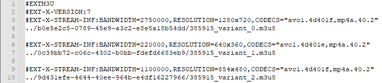
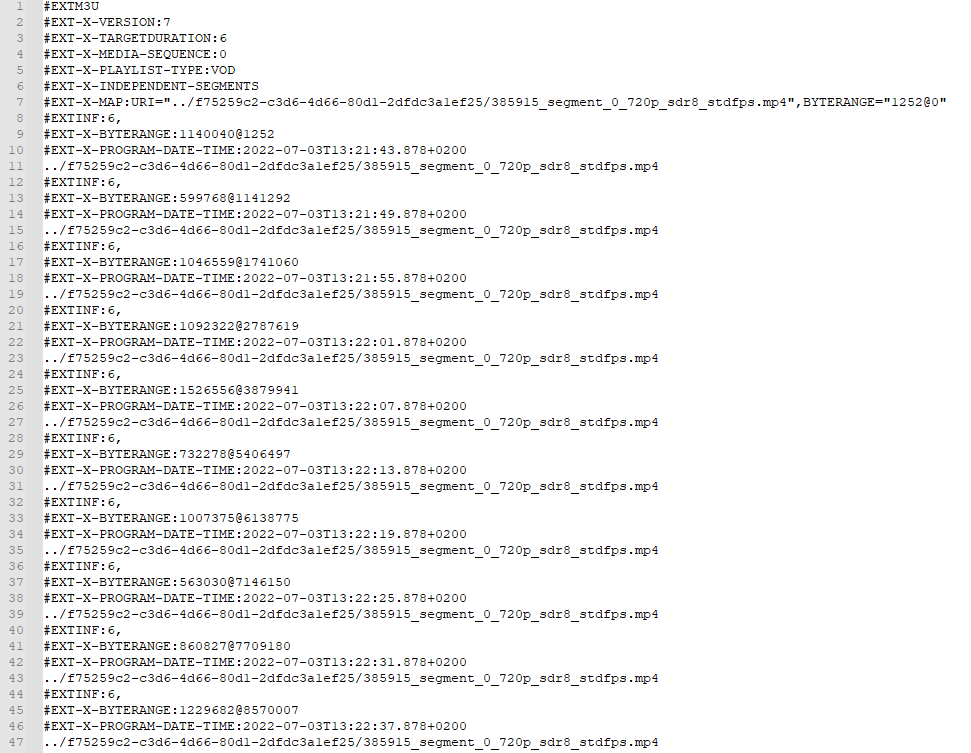
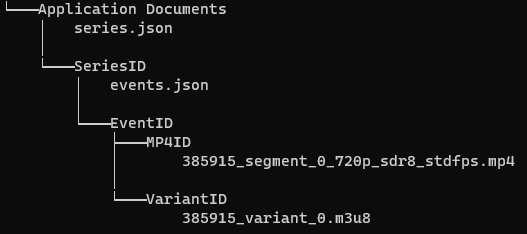

# Download

Wie bereits in der Motivation und in den Anforderungen beschrieben, ist die Download-Funktion ein wichtiges Feature, dass umgesetzt werden sollte. Im Folgenden wird die Umsetzung der Funktion dargestellt.

## Grundlagen
Die Videos liegen im HLS-Format vor. Das bedeutet in unserem Fall, es liegt eine sogenannte Master-Playlist vor, die auf unterschiedliche Varianten-Playlists verweist, wobei eine Varianten-Playlist immer eine bestimmte Auflösung speichert. Das folgende Bild zeigt eine beispielhafte Master-Playlist.  

*Master-Playlist mit drei Varianten*

Die angegebenen Pfade führen zur jeweiligen Variante, welche die Datei ist, die die eigentlichen Abspielanweisungen enthält.

*Ausschnitt aus einer Varianten-Playlist*  

Die Varianten-Playlist kodiert gewisse Byteranges im Video mit den zugehörigen Abschnitten in einer fragmentierten MP4-Datei (fMP4), deren URL spezifiziert wird. Eine fMP4 muss keine einzelne Datei sein, sondern kann auch aus mehreren Dateien bestehen, was bei educast aber nicht der Fall ist.  

Um ein Video offline abspielen zu können, muss also nur eine MP4-Datei und die dazugehörige Varianten-Playlist heruntergeladen werden. Nachfolgend wird die Speicherstruktur erläutert.

## Speicherung

Um die Daten strukturiert abspeichern zu können, wird auf das App-Verzeichnis zugegriffen. In diesem Verzeichnis können Dateien persistent gespeichert werden, ohne dass Zugriff von außerhalb möglich ist (Videos können also nicht aus dem Speicher extrahiert werden).

Die Speicherung von Videos erfolgt hierarchisch, geordnet nach den Serien, denen sie angehören. Auf erster Ebene des App-Verzeichnisses sind die Metadaten aller Serien, von denen ein oder mehr Videos heruntergeladen sind, im JSON-Format gespeichert. Dies ermöglicht die Indizierung und das Darstellen von Serien-Metadaten wie bspw. dem Titel, auch wenn das genutzte Gerät offline ist.  
Auf selbiger Ebene existiert für jede Serie ein Verzeichnis, in dem die jeweiligen Videos gespeichert werden. Im Serien-Verzeichnis sind wiederum alle Video-Metadaten von den Downloads gespeichert, genauso wie der relative Pfad zur Varianten-Playlist. Da die Playlist den Pfad zur MP4-Datei speichert, kann sie zum Abspielen einfach als Input für den Player genutzt werden.

  
*Exemplarische Darstellung der resultierenden Ordnerstruktur  
(Für eine bessere Übersicht wurden die tatsächlichen IDs, die eigentlich als Ordnernamen dienen, ersetzt)*

## Herunterladen

Nach der Extraktion des Pfades der Varianten-Playlist, kann diese ohne Besonderheiten heruntergeladen und im Serienordner abgelegt werden. Hier funktioniert das Herunterladen über eine HTTP-Request, deren Response-Body der Dateiinhalt ist. Somit muss nur die Antwort gespeichert werden.

Bei den MP4-Dateien ist ein komplexeres Verfahren notwendig. Da es sich um Vorlesungsvideos handelt, welche standardmäßig eine Länge von 90 Minuten haben, ist mit sehr großen Dateien zu rechnen. Dieser Umstand erfordert es, dass die Videos fortlaufend in eine Datei geschrieben werden. Dies wurde mit einer Streamed Response umgesetzt, deren Senke, also Datenendpunkt, eine Datei ist. Somit werden die Pakete, die vom Gerät empfangen werden, sukzessive auf die Festplatte geschrieben, ohne die gesamte Datei im RAM zwischenzuspeichern.

Um den Download mehrerer Videos gleichzeitig zu ermöglichen, werden sogenannte Download-Worker genutzt. Es existiert ein Pool an Download-Workern, aus denen immer ein freier gewählt wird, um einen Download zu starten. Sollten alle belegt sein, werden die Downloads in eine Warteschlange eingefügt und nacheinander abgearbeitet. Aktuell ist die Zahl der Download-Worker auf drei gesetzt, kann aber in der Datei `educast/lib/download/download_pool.dart` angepasst werden.