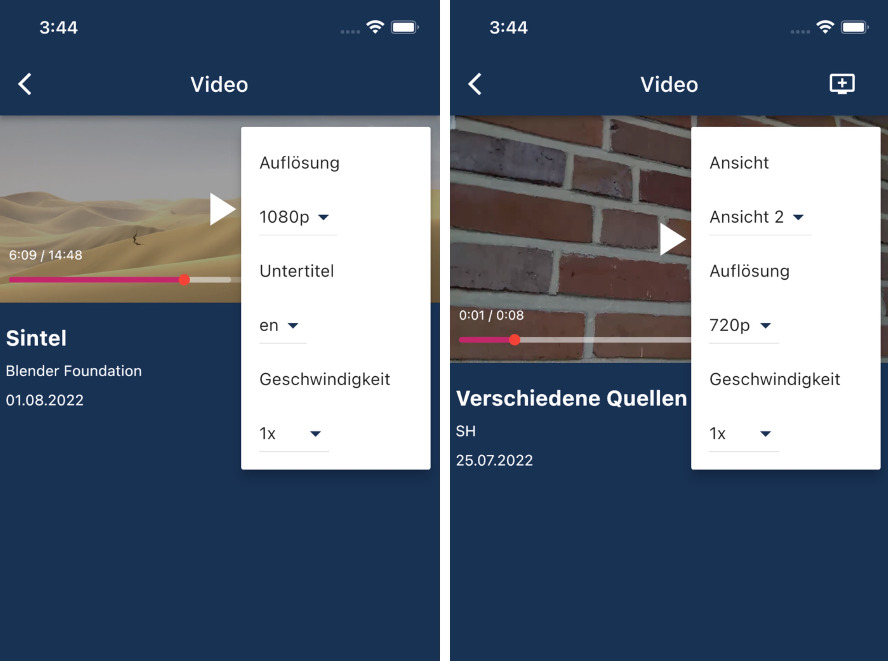

# Player

Kernbestandteil der App ist der integrierte Videoplayer. Dieser baut auf dem [„Flick Videoplayer“](https://pub.dev/packages/flick_video_player) auf und wurde an unsere speziellen Anforderungen angepasst. Der Flick Videoplayer wiederum basiert auf dem [offiziellen Videoplayer](https://pub.dev/packages/video_player) unseres verwendeten Frameworks [Flutter](https://flutter.dev). 

## Die Entscheidung für den Flick Videoplayer

Die Entscheidung den Flick Videoplayer als Basis zu nutzen, war eine der zentralen Entscheidungen dieses Projekts. Nach dem Untersuchen mehrerer Alternativen und nachdem sich alle Gruppenmitglieder bzgl. Dieser Thematik informiert hatten, haben wir uns für diese Lösung entschieden.

Die erste Alternative wäre gewesen, den offiziellen Flutter Video Player als Basis zu verwenden. Dieser stellt jedoch lediglich Grundfunktionalitäten zur Verfügung, was diese Lösung sehr aufwändig für den begrenzten Projektzeitraum und unsere begrenzte Vorerfahrung gemacht hätte. Als ersten Player, der für uns grundsätzlich infrage kam und der auf dem Flutter Videoplayer basiert, haben wir uns [„Chewie“](https://pub.dev/packages/chewie) genauer angeschaut. Wir haben uns letztendlich gegen diesen Player entschieden, da bei ihm abhängig vom verwendeten Betriebssystem andere Benutzeroberflächen verwendet werden. Einerseits hielten wir die iOS-Version für unpraktisch und andererseits war es ausdrücklich gewünscht, dass der Player auf beiden Plattformen möglichst identisch aussieht. Dies wäre beim [„Better Player“](https://pub.dev/packages/better_player) der Fall gewesen. Dieser hätte auch wichtige Funktionen wie das Ändern der Wiedergabegeschwindigkeit, das Anzeigen von Untertiteln oder das Ändern der Videoauflösung unterstützt. Nachdem allerdings bei der Integration in unsere App erhebliche Performanceprobleme aufgetreten waren und diese dann auch in der, von den Entwicklern zur Verfügung gestellten, Test-Applikation auftraten, mussten wir uns gegen den Better Player entscheiden. Es konnte keine Ursache für diese Probleme gefunden und behoben werden. 

Zuletzt fanden wir den angesprochenen [Flick Video Player](https://pub.dev/packages/flick_video_player). Dieser baut ebenfalls auf dem Basisplayer von Flutter auf, stellt bereits einige wichtige Funktionen zur Verfügung, hat uns optisch angesprochen und ist gut anpassbar bzw. erweiterbar. Da hier auch die Performance stimmte und es keine sonstigen Probleme gab, haben wir uns schließlich dafür entschieden den Flick Player zu verwenden. 

## Allgemeiner Aufbau

### Flick Videoplayer

*Benutzeroberfläche des Flick Videoplayers*

Unsere App nutzt die Benutzeroberfläche des Flick Players und dessen Funktionen für das Wechseln von Videos und das Anzeigen von Untertiteln. Er stellt also die grundlegenden Bedienelemente wie Play, Pause, +10s, -10s per Doppeltap, einen Vollbildmodus und das Navigieren per Zeitleiste zur Verfügung. 

### Eigenes Menü im Videoplayer

*Eigenes Menü im Videoplayer*

Darauf aufbauend haben wir ein Menü für zusätzliche Funktionalitäten erstellt. 
Dieses Menü ermöglicht es Nutzern abhängig vom Video: 

- Die Wiedergabegeschwindigkeit zu ändern,
- die Auflösung zu ändern,
- zwischen verschiedenen Ansichten zu wechseln,
- und Untertitel anzuzeigen.

### Anpassungen des Flick Videoplayers

Der Flick Videoplayer stellt zwei anpassbare Klassen zur Verfügung ([DataManager](https://github.com/GeekyAnts/flick-video-player/blob/master/example/lib/custom_orientation_player/data_manager.dart) und [CustomOrientationControls](https://github.com/GeekyAnts/flick-video-player/blob/master/example/lib/custom_orientation_player/controls.dart)), was wir für dieses Menü genutzt haben. Diese Änderungen reichten jedoch nicht aus und daher mussten wir interne Klassen des Players verändern und ihn dafür lokal in das Projekt integrieren. Dies war erforderlich, um zu gewährleisten, dass die Wiedergabeposition unverändert blieb, wenn die Auflösung oder die Ansicht gewechselt wurde. Im Ordner *flick_video_player/lib/src/manager* wurden an folgenden Stellen Änderungen vorgenommen:

    	flick_manager.dart: handleChangeVideo( )
    	video_manager.dart: _handleChangeVideo( ), _changeVideo( )

Die Änderungen sind jeweils mit dem Stichwort "CHANGED" markiert.

## HTTP Live Streaming (HLS)

Wir verwenden in der App [HTTP Live Streaming (HLS)](https://developer.apple.com/documentation/http_live_streaming). Für das Abspielen eines Videos erhält der Player eine Liste mit URLs zu Masterplaylisten. Gibt es für das Video mehrere Ansichten, sind es mehrere Masterplaylisten. Innerhalb dieser Masterplaylisten gibt es wiederum mehrere Variantenplaylists für die einzelnen Auflösungen. Um diese auszulesen, verwenden wir das Paket [flutter_hls_parser](https://pub.dev/packages/flutter_hls_parser). 

## Restriktionen

Momentan ist es leider nicht möglich mehrzeilige Untertitel anzuzeigen und das Menü des Players im Vollbildmodus zu nutzen. Weitere Informationen hierzu finden sich im Bereich [Restriktionen](../restriktionen.md).

