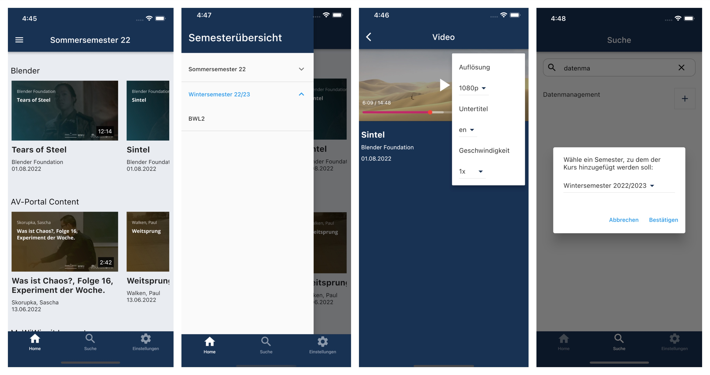

# Willkommen zur educast.nrw-App Dokumentation

Auf dieser Website finden Sie die technische Dokumentation der Mobileapp educast.nrw.

Um einen komfortablen, mobilen Zugriff auf mit educast.nrw bereitgestellte Inhalte durch Studierende zu ermöglichen, wurde die mobile Anwendung entwickelt, die hier dokumentiert wird.

*Zentrale Ansichten der App*

## Struktur der Dokumentation
Auf dieser Seite wird nachfolgend auf das Projekt [educast.nrw](#educast.nrw) und die Motivation eingegangen. Für die weitere Orientierung beachten Sie bitte die Navigationsleiste auf der linken Seite. Auf folgende Aspekte wird in dieser Dokumentation eingegangen.

* [Anforderungen](anforderungen.md)
* [Userguide](userguide.md) und [Setup des Systems](setup.md)
* [Entwurf und Struktur der App](entwurf.md)
* [Funktionsweise des Logins](login.md)
* [Datenbank](database.md) und Implementation des [Players](implementation/player.md) und des [Downloads](implementation/download.md)
* [Restriktionen und Limitationen der App](restriktionen.md)
* [Ausblick](future_work.md)

## educast.nrw
Die Weiterentwicklung videobasierter Lehre übernimmt in Nordrhein-Westfalen das Projekt [educast.nrw](https://educast.nrw/de/). Als Teil des Programms [„Digitale Hochschule NRW“](https://www.dh.nrw) wird es durch das Land NRW gefördert. Das educast.nrw-Konsortium bilden die Universität Duisburg-Essen, die Universität zu Köln und konsortialführend die Westfälische Wilhelms-Universität Münster. 

educast.nrw nutzt für die Erstellung, Verwaltung und Bereitstellung der Videoinhalte die Software [Opencast](https://opencast.org). Opencast baut Systeme für das Hochschulumfeld mithilfe von Entwicklern internationaler Hochschulen und Organisationen. Die Systeme sind nach dem Open-Source-Ansatz frei verfügbar. 

Die Video App soll in Zukunft im Rahmen von educast.nrw eingesetzt werden und auch der Opencast-Community als Open-Source-Software zur Verfügung stehen. 

## Motivation
Im Mittelpunkt der Entwicklung stand es, den Endnutzern, also Studierenden, einen komfortablen, simplen und modernen Weg zu bieten, auch über Mobilgeräte auf Vorlesungsvideos zugreifen zu können.   
Bei YouTube oder Streaminganbietern wie Netflix und Amazon Prime, sind Smartphone-Apps längst ein gängiger und einfacher Weg auf die Angebote zuzugreifen. Für digitale Vorlesungen gilt das nicht, der Zugriff ist unnötig aufwendig und umständlich.  
Ein weiteres Problem entsteht durch infrastrukturelle Unzulänglichkeiten beim Netzausbau in NRW bzw. Deutschland. Vorlesungen sollten für den Konsum unterwegs auch Offline zur Verfügung stehen, damit Internetunterbrechungen nicht zu Streamingabbruch führen und Datenvolumen gespart werden kann.  
Die abgeleiteten Anforderungen können [hier](anforderungen.md) eingesehen werden.
