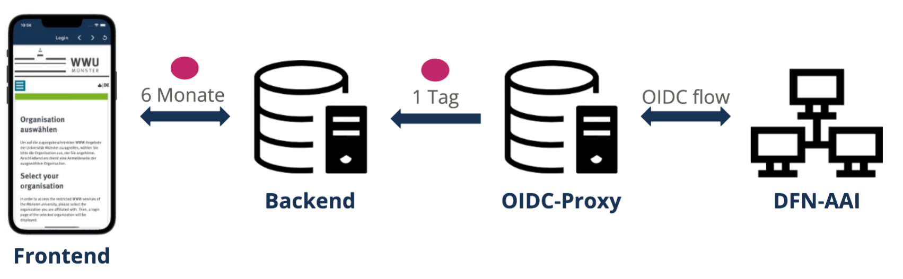

# Login​

Im Folgenden werden die technischen Hintergründe des Loginprozesses beschrieben und wie damit eine sichere Kommunikation gewährleistet wird.   

Im [Userguide](userguide.md) wird genauer erläutert, wie man als Nutzer:in durch den Loginprozess navigiert. 

Beim Öffnen der App wird geprüft, ob lokal bereits ein [Token hinterlegt](login.md#tokenspeicherung) ist. Sofern dies der Fall ist, öffnet sich automatisch der Homescreen. Andernfalls, wird der:die Studierende zum Anmelden aufgefordert und der Loginprozess angestoßen. 

## Loginprozess

*Informationsaustausch zwischen dem Frontend, Backend, OIDC Proxy und DFN-AAI*

Durch Auslösen des Loginprozesses wird der OpenIDConnect (OIDC) Flow nach der [OIDC-Spezifikation](https://openid.net/specs/openid-connect-core-1_0.html) angestoßen. OIDC ist die Identifikationsschicht, welche auf dem Autorisierungs-Framework OAuth 2.0 aufbaut. Ausgeführt wird dieser Flow von einem OIDC-Proxy, welcher unserem Projekt zur Verfügung gestellt wurde und der in dem OIDC-Flow die Relying-Party darstellt. OIDC-Provider, also die Partei welche die Authentifizierung der User übernimmt und dem die Relying-Party vertraut, ist hier die Authentifikations- und Autorisierungs-Infrastruktur des Deutschen Forschungsnetzes (DFN-AAI). Da alle beteiligten Universitäten und Fachhochschulen Teil der DFN-AAI sind, melden sich die Studierenden mit den Zugangsdaten ihrer Institution an. 

Bei erfolgreichem Ablauf des OIDC-Flows, erhält unser Backend ein Token mit Gültigkeit von einem Tag, welches alle relevanten Nutzerdaten enthält. Unter anderem enthält es die Domain der Universität oder Fachhochschule des:der Studierenden, was die Zuordnung der Studierenden zur jeweiligen Universität oder Fachhochschule ermöglicht. Dies ist wichtig für die Kommunikation zwischen dem App-Backend und educast.nrw, wie Sie [hier](entwurf.md) genauer nachlesen können. Welche Nutzerdaten unser Backend dauerhaft speichert, finden Sie  [hier](database.md). 

Zur weiteren Kommunikation wird dem Frontend daraufhin ein sechs Monate gültiges Token im JSON Web Token (JWT) Format ausgestellt. Dieses Token wird bei jeder Anfrage ans App-Backend im HTTP-Header `backend-ID-token` mitgeschickt, um eine Identifikation des Nutzers zu ermöglichen. Jegliche Kommunikation läuft außerdem über HTTPS, um ein Abfangen und Entschlüsseln des Token auf dem Transportweg zu verhindern. 

### Tokenspeicherung
Um eine sichere Speicherung des Token zu gewährleisten, nutzen wir das Flutter Plugin *flutter_secure_storage*. Dieses speichert den Token in der Keychain von iOS bzw. in den EncryptedSharedPreferences von Android, sodass der Token jeweils verschlüsselt in den für sensible Daten vorgesehenen key-value stores gesichert wird. 

## JWKS Endpunkt
Damit die Signatur des JWTs verifiziert werden kann, haben wir außerdem einen JSON Web Key Set (JWKS) Endpunkt eingerichtet. Unter diesem [Link](https://api.app-staging.educast.cloud/oidc/jwks) ist unser JWKS Endpunkt zu finden und damit der öffentliche Schlüssel zur Verifikation der Signatur unseres Backends abrufbar. Durch die in der [OIDC-Spezifikation (10.1.1)](https://openid.net/specs/openid-connect-core-1_0.html#10.1.1) empfohlenen Rotation von asymmetrischen Schlüsselpaaren stehen dort ggf. mehrere Schlüssel, wobei der Schlüssel mit der höchsten ID der aktuellste sein sollte. Die ID des Schlüsselpaares wird aber auch im header `kid` des JWTs mitgeschickt.

### Einfügen eines neuen public keys
Wenn Sie als Administrator ein [neues Schlüsselpaar generiert](setup.md#keypair) haben, steht Ihnen die Funktion `add_new_key` in der *login/__init__.py* Datei zur Verfügung. Diese fügt Ihren öffentlichen Schlüssel automatisch in den JWKS Endpunkt ein.  

## Logout
In den Einstellungen der App können sich Studierende auch wieder abmelden. Dadurch wird der lokal gespeicherte Token gelöscht und der:die Studierende auf die Startseite weitergeleitet, sodass ein erneutes Anmelden notwendig ist, um auf die Funktionen der App zuzugreifen. 

