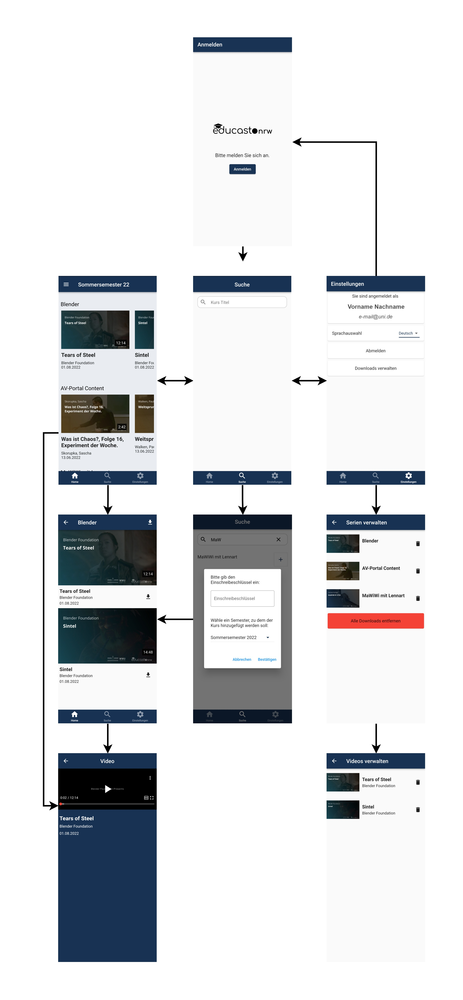

# Userguide

In diesem Abschnitt wird Ihnen eine Schritt-für-Schritt Anleitung beschrieben, wie Sie unsere App nutzen können und welche Funktionalitäten Ihnen zur Verfügung stehen. 

Damit die Studierenden alle Funktionen der App nutzen können und sich gut zurechtfinden, gibt es mehrere möglichst intuitive Ansichten. In der folgenden Grafik sind diese Ansichten und ihre Navigationswege zu sehen.

## Login

Bevor man auf die eigentliche App zugreifen kann, muss man sich auf der Login Seite anmelden. Der Anmeldeprozess erfolgt über die Authentifikations- und Autorisierungs-Infrastruktur des Deutschen Forschungsnetzes (DFN-AAI). Dabei wählt der:die Studierende seine Universität oder Fachhochschule aus und meldet sich dann mit den entsprechenden Zugangsdaten an. Detailliertere Informationen und technische Hintergründe sind auf der [Login Seite](login.md) zu finden. Nach erfolgreichem Anmelden kommt man zur Hauptansicht der App.

## Bottom Navigation Bar

Über die dauerhaft eingeblendete Bottom Navigation Bar kann man zwischen drei Ansichten wählen. Diese Funktionalität sollte den Nutzern von anderen Apps bereits bekannt sein. Die Navigation zwischen den Ansichten [Home](userguide.md#home), [Suche](userguide.md#suche) und [Einstellungen](userguide.md#einstellungen) ist möglich.

### Home
Auf der Homeansicht sieht man zunächst einmal alle im derzeitigen Semester abonnierten Kurse und die zugehörigen Vorlesungsvideos. Zum Aktualisieren zieht man die Seite einmal nach unten (Pull-to-Refresh). 

Die Ansicht ist so aufgebaut, dass alle Kurse untereinander angeordnet sind und man durch vertikales Scrollen alle seine Kurse angezeigt bekommt. Durch Anklicken des Kurstitels wechselt man zur [Kursansicht](userguide.md#kursansicht) des jeweiligen Kurses. 

Die Videos eines Kurses sind nebeneinander angeordnet und durch horizontales Wischen alle zu betrachten. Dabei werden einem zu jedem Video bereits der Titel, der:die Dozierende, das Erstelldatum, ein Vorschaubild und die Dauer des Videos angezeigt. Bei Anklicken dieses Videobereichs wird man auf die [Videoansicht](userguide.md#videoansicht) weitergeleitet. 

### Kursansicht
In der Kursansicht finden Sie alle Vorlesungsvideos eines Kurses. Diese sind nun untereinander angeordnet und jeder Videoblock enthält die gleichen Informationen wie in der Homeansicht. Durch Anklicken eines Videoblocks wechseln Sie zu dessen [Videoansicht](setup.md#videoansicht). Hier besteht die Möglichkeit ein Video oder gleich alle Videos des Kurses herunterzuladen. Dadurch klickt man entweder auf das Download-Symbol rechts neben dem Titel eines Videos oder auf das Download-Symbol ganz oben rechts neben dem Kurstitel. 

### Videoansicht
Die Videoansicht wird durch den auf die App zugeschnittenen [Video Player](implementation/player.md) umgesetzt und bildet das Herzstück unserer Anwendung. Hier können die Vorlesungsvideos angeschaut werden. Unter dem Video ist die Beschreibung der Vorlesung angezeigt. Über ein Menü kann zwischen unterschiedlichen Wiedergabeschwindigkeiten, Auflösungen und falls vorhanden auch auf verschiedene Ansichten, beispielsweise der Foliensicht und der Sicht auf den:die Dozierende:n, gewählt werden. Außerdem sind die Standard-Steuerungsoptionen verfügbar, wie Start/Stopp des Videos in der Mitte des Bildschirms, 15 Sekunden vor- oder zurückspringen durch Doppelklicken im rechten oder linken Bereich des Videos und der Wechsel in den Vollbildmodus durch Anklicken des bekannten Symbols unten rechts. 

## Suche 
In der Ansicht Suche gibt es die Möglichkeit neue Kurse zu abonnieren. Dazu muss in der Suchleiste nach dem Titel, dem:der Dozent:in oder der Beschreibung gesucht werden, woraufhin dann die zur Anfrage passenden Kurse, der Universität oder Fachhochschule des:der Student:in, erscheinen. Durch vertikales Scrollen nach unten können noch weitere passende Kurse nachgeladen werden (bei hoher Trefferanzahl).
Das Abonnieren eines Kurses erfolgt über das Plus-Symbol.

Daraufhin öffnet sich ein Bereich, in dem das Semester, zu dem der Kurs hinzugefügt werden soll, ausgewählt werden kann. Voreingestellt ist das aktuelle Semester, es ist aber auch möglich das vorherige oder nächste Semester zu wählen. Außerdem erscheint in diesem Auswahlbereich auch ein Feld für einen Einschreibeschlüssel, sofern der:die Dozent:in einen hinterlegt hat. In dem Fall können sich Studierende nicht ohne korrekte Eingabe des Einschreibeschlüssels zu dem Kurs anmelden. 

Falls ein Kurs nicht durch einen Einschreibeschlüssel geschützt ist, ist bereits vor dem Abonnieren durch Klicken auf den Kursnamen eine Navigation zur Kursansicht möglich. 

## Einstellungen
In den Einstellungen werden oben die Nutzerdaten mit denen man angemeldet ist angezeigt. Darunter gibt es die Möglichkeit die Sprache der App zu wählen. Zur Zeit stehen Englisch und Deutsch zur Verfügung. 

Außerdem können die Downloads verwaltet werden. Die Ansicht zeigt alle heruntergeladenen Videos, sortiert nach den Kursen. Eine Löschfunktion steht für jedes Video, alle Videos eines Kurs und alle Videos insgesamt zur Verfügung. 

Über den Logout-Button ist das Abmelden möglich, wodurch man wieder auf die Startseite gelangt und zum Login aufgefordert wird.

## Offline-Modus
Sollte keine Internetverbindung bestehen, stehen trotzdem umfangreiche Funktionen zur Verfügung. Im Prinzip bleiben sowohl Homeansicht, wie auch Kursansicht und Videoansicht intakt mit dem Unterschied, dass nun nur heruntergeladene Videos angezeigt werden. Wie Videos heruntergeladen werden können, ist [hier](userguide.md#kursansicht) nachzulesen.  
Da die Suche nur online zur Verfügung steht, gibt es hier einen Hinweis, die Verbindung zu überprüfen.